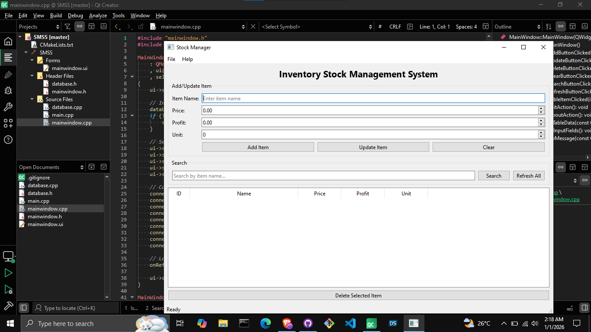
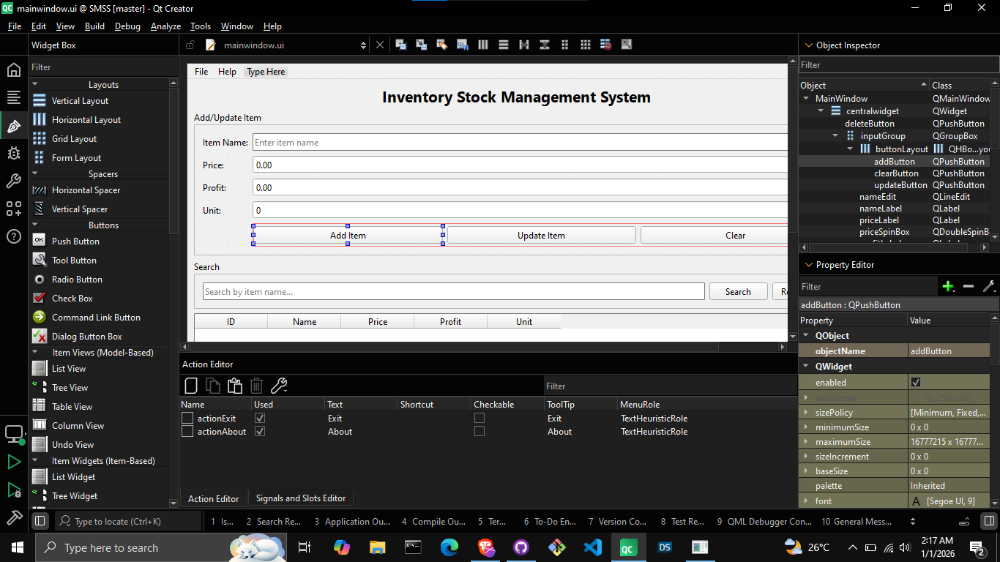

# StockManager

A desktop application built with **Qt Widgets** and **CMake** for managing stock data, including prices and profit calculations.  
Designed as a lightweight, offline-first Windows application.

---

## ✨ Features
- Add, edit, and delete stock records
- Track prices and profit/loss
- Simple Qt Widgets interface
- Offline local data storage
- Windows desktop application

---

## 🖼 Screenshots

### Main Window


### UI Design


> Screenshots are taken from the actual application running on Windows.

---

## 🧰 Requirements

### For Users
- Windows 10 or later

### For Developers
- Qt 6.x (Qt Widgets)
- CMake 3.16 or newer
- Compiler:
  - MinGW **or**
  - MSVC

---

## 📦 Installation (Offline Installer)

1. Go to the **Releases** section of this repository.
2. Download the Windows installer (`.exe`).
3. Run the installer and follow the setup wizard.
4. Launch the app from the Start Menu or Desktop shortcut.

No internet connection is required after installation.

---

## 🛠 Build From Source

```bash
git clone https://github.com/mrbgkok/SMC
cd StockManager
mkdir build
cd build
cmake ..
cmake --build .
